## 一、AI发展历程
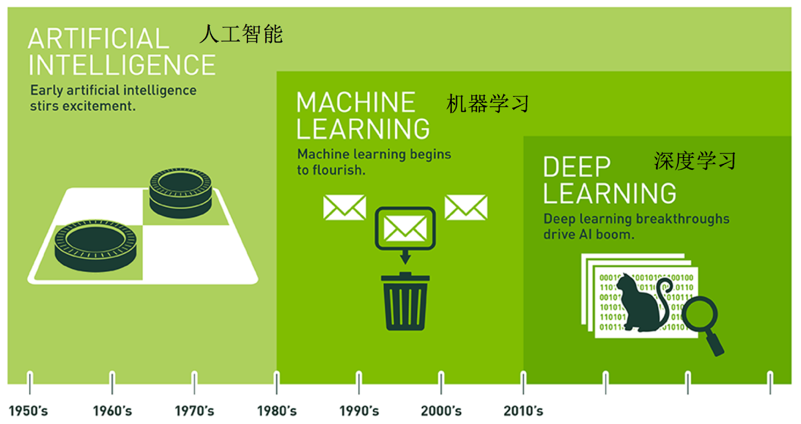  

1980年代是正式成形期，尚不具备影响力。

1990-2010年代是蓬勃发展期，诞生了众多的理论和算法，真正走向了实用。

2012年之后是深度学习期，深度学习技术诞生并急速发展，较好的解决了现阶段AI的一些重点问题，并带来了产业界的快速发展。

### 1.1 机器学习 
机器学习是从数据中自动分析获得模型，并利用模型对未知数据进行预测。  
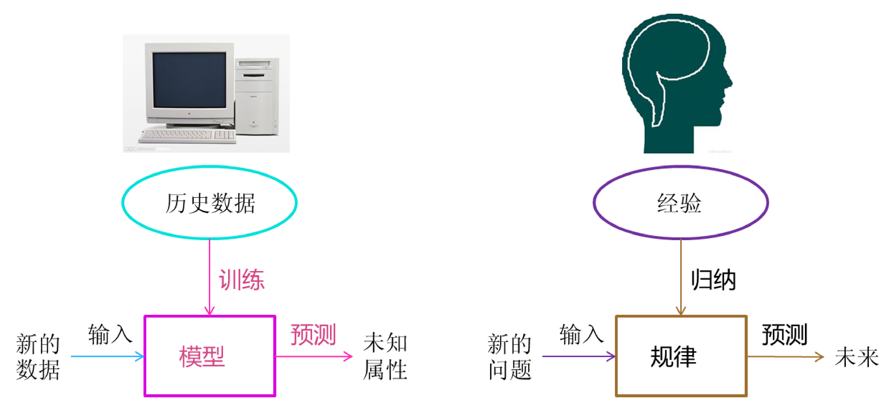  

### 1.2 深度学习
深度学习通过组合低层特征形成更加抽象的高层表示属性类别，以发现数据的分布式特征表示。
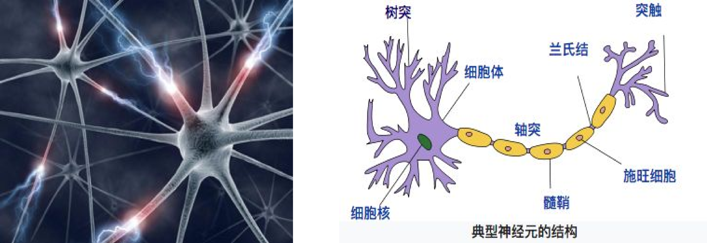 

## 二、机器学习工作流程
机器学习（Machine Learning, ML）的核心思想是让计算机能够通过数据学习，并从中推断出规律或模式，而不依赖于显式编写的规则或代码。
简单来说，机器学习的工作流程是让机器通过历史数据自动改进其决策和预测能力。
机器学习的工作流程可以简化为以下几个步骤：
### 1.获取数据
机器学习的起点是数据。没有数据，算法就无法学习。这一步的目标是收集足够多、质量足够好的数据来支撑后续建模。  
**数据来源**：

- 公开数据集：如Kaggle、UCI机器学习库、天池等平台提供的大量开源数据。

- 公司内部数据库：从业务系统（如CRM、ERP、日志系统）中提取历史数据。

- 网络爬虫：通过编写爬虫从网页抓取数据（需遵守法律和robots协议）。

- 传感器/IoT设备：实时采集物理世界的数据。

- 人工标注：对于分类、目标检测等任务，需要人工为原始数据打标签。

**注意事项**：

- 数据量是否足够？样本量过小容易导致过拟合。

- 数据是否代表真实分布？训练集和未来应用场景的分布应尽可能一致。

- 数据是否存在偏见？例如，人脸识别训练集中如果只有某一肤色，模型可能对其他群体效果差。

### 2.数据预处理
原始数据往往是“脏”的，直接使用会导致模型效果差甚至无法收敛。预处理就是清洗和整理数据，使其满足算法输入要求。  
1.缺失值处理：  
- 删除缺失严重的行或列。
- 用均值、中位数、众数填充。
- 使用模型预测缺失值（如KNN插补）。
  
2.异常值检测与处理：  
- 通过箱线图、Z-score等方法识别异常值。
- 可删除、截尾（winsorize）或转换异常值。 
 
3.数据格式统一：  
- 日期时间解析、单位换算、文本编码统一等。  

4.数据集成：  
- 将多个数据源合并，注意去重和字段对齐。  

5.数据变换：  
- 对偏态分布的特征做对数、平方根等变换，使其更接近正态分布（某些模型要求）。  

6.类别特征编码：  
- 将文本型类别变量转换为数值，如独热编码、标签编码。  

### 3.特征工程
特征工程是机器学习中极具创造性的一步，直接影响模型的上限。它旨在从原始数据中构造出更能体现数据内在规律的输入特征。  

**特征选择**：从现有特征中挑选出对预测最有用的子集，减少噪声和维度灾难。

- 过滤法：方差阈值、相关系数、卡方检验。

- 包裹法：递归特征消除（RFE）。

- 嵌入法：L1正则化、树模型的特征重要性。

**特征提取**：通过变换生成新特征。

- 多项式特征：如 $x_1^2$, $x_1x_2$等

- 分箱：将连续变量离散化。

- 聚合统计：对分组数据进行计数、均值、标准差等。

- 时间序列特征：滞后项、滑动窗口统计。

**特征缩放**：使不同尺度的特征处于同一量级，对基于距离的模型（如SVM、KNN）和梯度下降优化的模型至关重要。

- 标准化（Z-score）：(x−μ)/σ

- 归一化（Min-Max）：(x−min)/(max−min)

### 4.机器学习
在准备好数据后，就可以选择算法并训练模型了。这一步包括：

**算法选择**：根据问题类型（分类、回归、聚类等）和数据特点（线性/非线性、样本量、特征类型）选择合适的算法。

- 线性模型：线性回归、逻辑回归。

- 树模型：决策树、随机森林、梯度提升树（XGBoost、LightGBM）。

- 支持向量机（SVM）。

- 神经网络：多层感知机、CNN、RNN等。

- 聚类算法：K-Means、DBSCAN等。

**划分数据集**：通常将数据分为训练集、验证集和测试集。常用比例70%训练，15%验证，15%测试，或采用交叉验证。

**训练模型**：将训练数据输入算法，通过优化算法（如梯度下降）最小化损失函数，学习模型参数。

**超参数调优**：使用验证集或交叉验证调整模型的超参数（如树的深度、学习率、正则化系数）。常用方法有网格搜索、随机搜索、贝叶斯优化。

### 5.模型评估
在测试集上评估最终模型的泛化能力，确保模型能处理未见过的数据。

**分类任务**：

- 混淆矩阵、准确率、精确率、召回率、F1分数。

- ROC曲线、AUC值。

- 对数损失。

**回归任务**：

- 均方误差（MSE）、均方根误差（RMSE）、平均绝对误差（MAE）。

- 决定系数 $R^2$

**聚类任务**：

- 内部指标：轮廓系数、Davies-Bouldin指数。

- 外部指标（有标签时）：调整兰德指数（ARI）、互信息（NMI）。

**过拟合/欠拟合诊断**：

- 比较训练集和测试集的表现差异，若训练集远好于测试集，则过拟合；若两者均差，则欠拟合。

**A/B测试（可选）**：在部分真实流量上对比新旧模型效果。

### 6.部署模型
将训练好的模型集成到实际生产系统中，提供在线或离线预测服务。

**部署方式**：

- 模型导出：将模型保存为标准格式（如PMML、ONNX、Pickle、HDF5）。

- REST API：使用Flask、FastAPI等框架封装模型，提供HTTP接口。

- 批处理：定期运行脚本，对大规模数据进行批量预测。

- 嵌入式部署：将模型压缩后嵌入移动端或边缘设备（如TensorFlow Lite）。

**监控与日志**：记录预测请求、响应时间、结果分布，便于后续分析。

**版本管理**：使用模型版本控制，便于回滚或对比。

### 7.持续改进
模型部署后并非一劳永逸，随着业务环境变化和数据分布漂移，模型效果会逐渐下降。需要建立反馈循环。

**模型监控**：

- 监控预测准确率、业务指标（如点击率、转化率）的变化。

- 检测数据漂移（特征分布变化）和概念漂移（标签关系变化）。

**模型更新**：

- 定期用新数据重新训练模型。

- 当监控指标触发阈值时，启动自动重训练流水线。

- 采用在线学习（如增量学习）实时更新模型参数。

**用户反馈**：收集用户对预测结果的反馈（如点击/不点击），作为新的标注数据。

**实验迭代**：尝试新算法、新特征，通过A/B测试验证效果，持续优化模型。

## 三、机器学习算法分类

### 1.监督学习
定义：输入数据是由输入特征值和目标值所组成，即输入的训练数据为有标签的。  
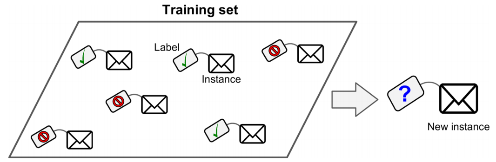  
回归问题和分类问题的本质一样，都是针对输入做出输出预测，其区别在于输出预测的类型。  
分类问题：给定一个新的模式，根据训练集推断它所对应的类别（如：+1，-1），是一种定性输出，也叫离散变量预测  
回归问题：给定一个新的模式，根据训练集推断它所对应的输出值（实数）是多少，是一种定量输出，也叫连续变量预测。

如果预测的结果为连续的值，是回归问题; 如为离散的值，是分类问题  

例如：根据肿瘤特征判断良性还是恶性，得到的是结果是“良性”或者“恶性”，是离散的;温度是连续的值,所以是回归。  

### 2.无监督学习
定义：输入数据没有被标记，也没有确定的结果，即样本数据类别未知，没有标签，需要根据样本间的相似性对样本集进行聚类，以发现事物内部结构及相互关系。  
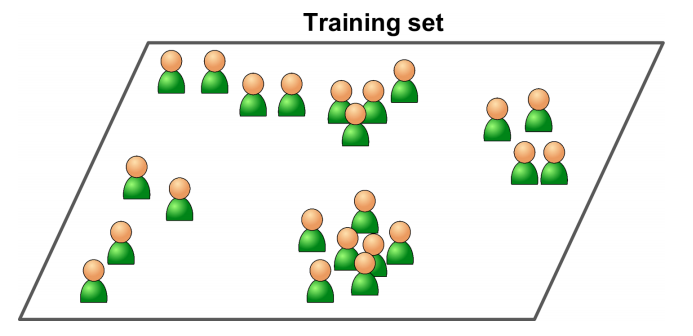
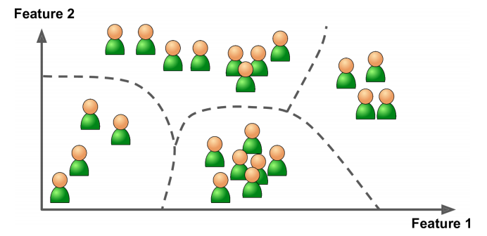
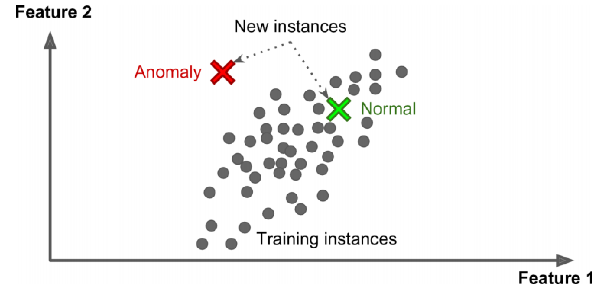  
无监督学习是在寻找数据集中的规律性，这种规律性并不一定要达到划分数据集的目的，也就是说不一定要“分类”。

这一点是比有监督学习方法的用途要广。譬如分析一堆数据的主分量，或分析数据集有什么特点都可以归于非监督学习方法的范畴。

### 3.半监督学习
定义：训练集数据一部分有标签而其余部分无标签，即训练集同时包含有标记样本和无标记样本。  
案例：循证医学  
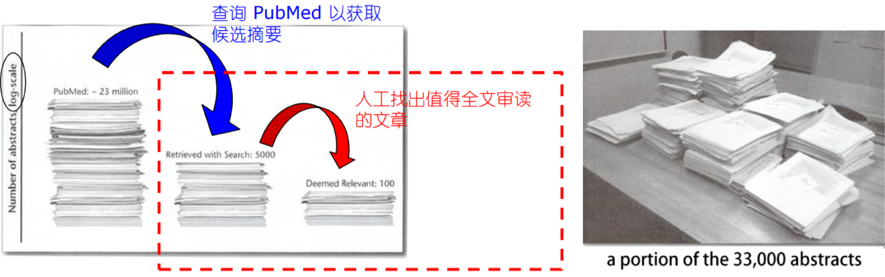
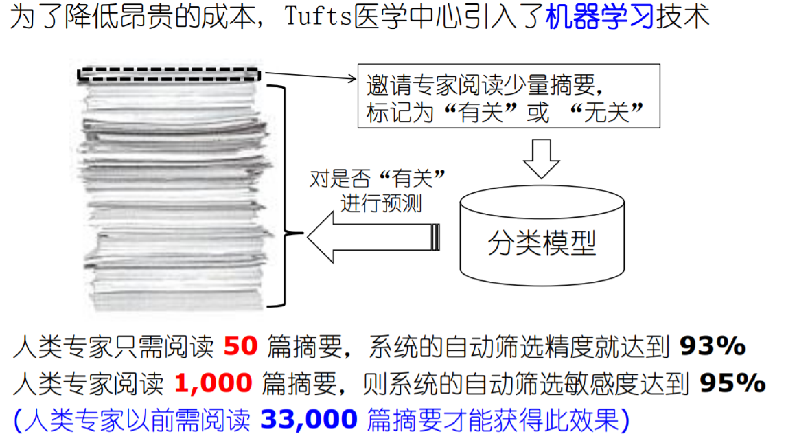

### 4.强化学习
定义：实质是make decisions 问题，即自动进行决策，并且可以做连续决策希望一段时间后获得最多的累计奖励。

主要包含四个要素：agent，环境状态，行动，奖励；  
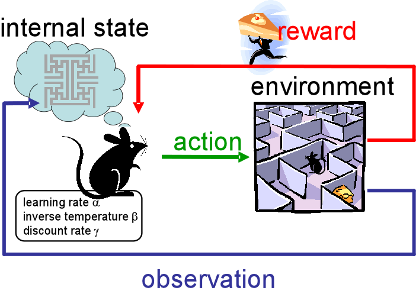
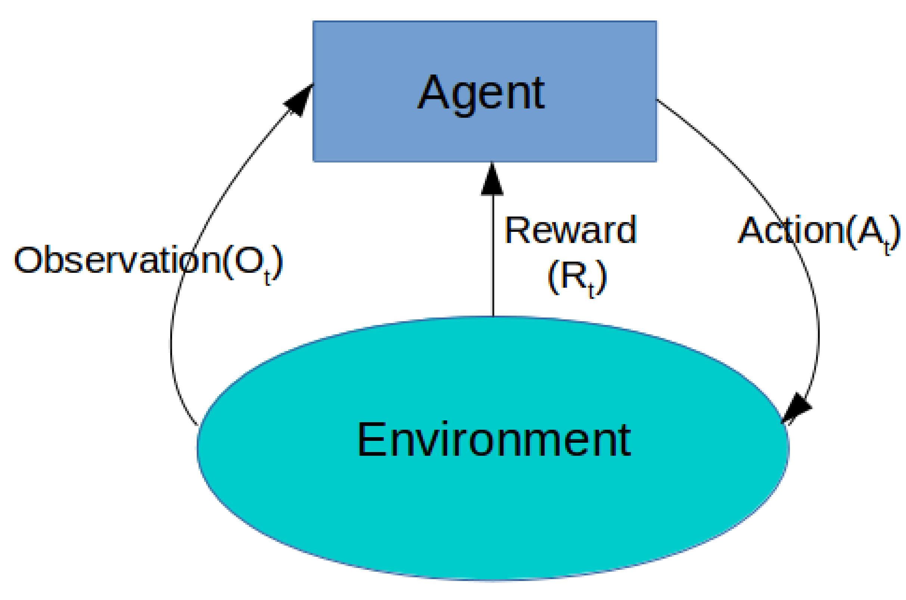  
案例1：小孩学走路  
小孩想要走路，但在这之前，他需要先站起来，站起来之后还要保持平衡，接下来还要先迈出一条腿，是左腿还是右腿，迈出一步后还要迈出下一步。

小孩就是agent，他试图通过采取行动（即行走）来操纵环境（行走的表面），并且从一个状态转变到另一个状态（即他走的每一步），当他完成任务的子任务（即走了几步）时，孩子得到奖励（给巧克力吃），并且当他不能走路时，就不会给巧克力。  

案例2：Multi-Agent Hide and Seek
https://openai.com/index/emergent-tool-use/

### 4.扩展（批量学习、在线学习）
在线学习：需要接收持续的数据流（例如股票价格）同时对数据流的变化做出快速或自主的反应。

如果你的计算资源有限，在线学习系统同样也是一个很好的选择：新的数据实例一旦经过系统的学习，就不再需要，你可以将其丢弃（除非你想要回滚到前一个状态，再“重新学习”数据），这可以节省大量的空间。

挑战：学习率，不良数据。  
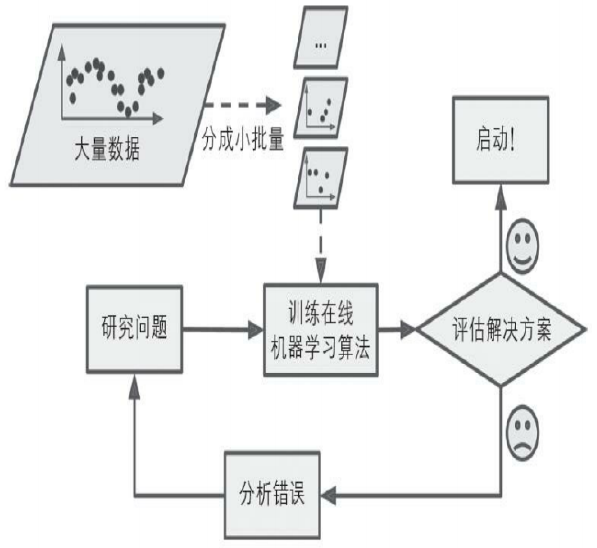 

