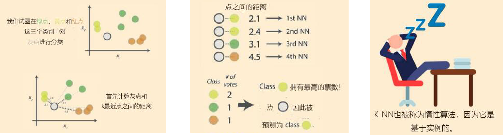
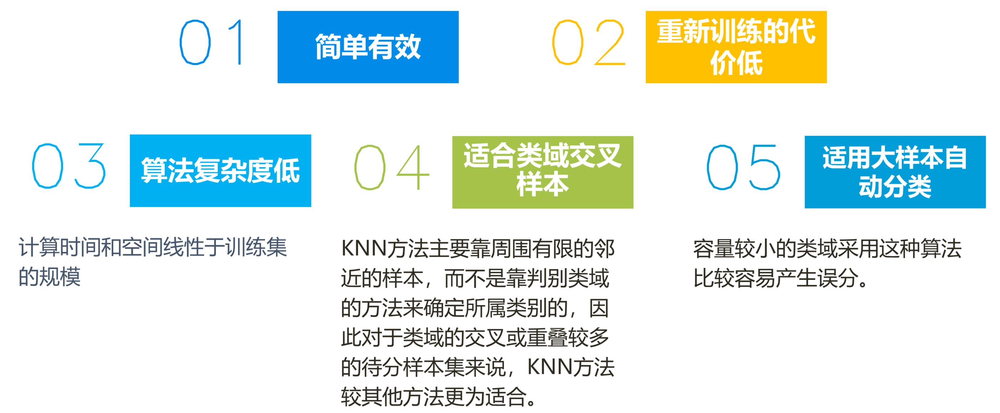
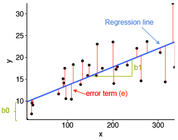
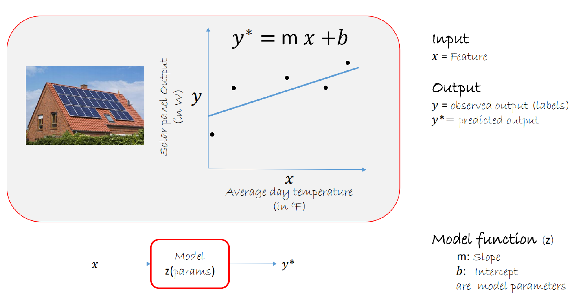
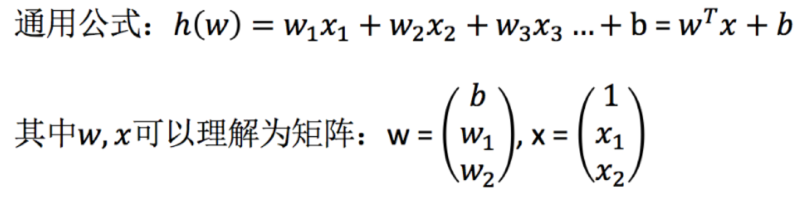

## 一、KNN算法
### 1.1 定义
KNN（K Near Neighbor）：k个最近的邻居，即每个样本都可以用它最接近的k个邻居来代表，即如果一个样本在特征空间中的k个最相似(即特征空间中最邻近)的样本中的大多数属于某一个类别，则该样本也属于这个类别。

最近邻 (k-Nearest Neighbors，KNN) 算法是一种分类算法，1968年由 Cover 和 Hart 提出，应用场景有字符识别、文本分类、图像识别等领域。

该算法的思想是：一个样本与数据集中的k个样本最相似，如果这k个样本中的大多数属于某一个类别，则该样本也属于这个类别，即，对每一个测试样本，基于事先选择的距离度量，KNN算法在训练集中找到距离最近(最相似)的k个样本，然后将k个样本的类别的投票结果作为测试样本的类别。

### 1.2 流程  
   
1）计算已知类别数据集中的点与当前点之间的距离  

2）按距离递增次序排序  

3）选取与当前点距离最小的k个点  

4）统计前k个点所在的类别出现的频率  

5）返回前k个点出现频率最高的类别作为当前点的预测分类  

### 1.3 特点
#### 优点
  

#### 缺点

像KNN这种基于内存的方法一大优点是：一旦训练集增加了新数据，模型能立刻改变。

缺点是分类时的最坏计算复杂度随着训练集增大而线性增加，除非特征维度非常低并且算法用诸如KD-树等数据结构实现。此外，我们要一直保存着训练集，不像参数模型训练好模型后，可以丢弃训练集。因此，存储空间也成为了KNN处理大数据的一个瓶颈。

#### K值的选择
K值过小：k值小，特征空间被划分为更多子空间（模型的项越多），整体模型变复杂，容易发生过拟合，k值越小，选择的范围就比较小，训练的时候命中率较高，近似误差小，而用test的时候就容易出错，估计误差大，容易过拟合。

K值=N：无论输入实例是什么，都将简单的预测他属于训练实例中最多的类。
  
M=3 合适，M=9 过拟合  

## 二、线性回归
### 2.1 定义
线性回归是利用数理统计中回归分析，来确定两种或两种以上变量间相互依赖的定量关系的一种统计分析方法，运用十分广泛。
针对数据集x和y，预测函数会根据输入特征x来计算输出值h（x）。其输入和输出的函数关系如下：
y=kx+b=b1x+b0  
单变量：  
  
   
多变量：  
   

