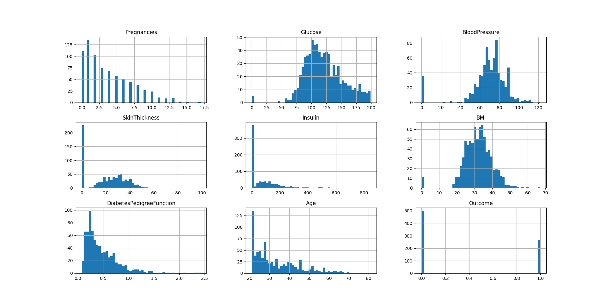
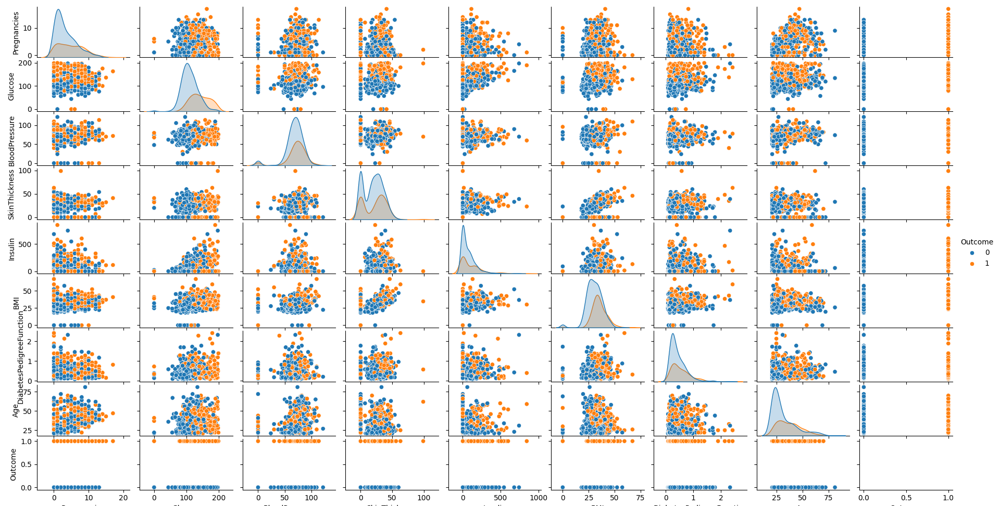

## 案例：用KNN预测印第安人糖尿病
### 一、获取数据
数据集：https://www.kaggle.com/datasets/uciml/pima-indians-diabetes-database?resource=download  
数据集的内容是皮马人的医疗记录，以及过去5年内是否有糖尿病。所有的数据都是数字，问题是（是否有糖尿病是1或0），是二分类问题。数据的数量级不同，有8个属性，1个类别：

    【1】Pregnancies：怀孕次数
    【2】Glucose：葡萄糖
    【3】BloodPressure：血压 (mm Hg)
    【4】SkinThickness：皮层厚度 (mm)
    【5】Insulin：胰岛素 2小时血清胰岛素（mu U / ml）
    【6】BMI：体重指数 （体重/身高）^2
    【7】DiabetesPedigreeFunction：糖尿病谱系功能
    【8】Age：年龄 （岁）
    【9】Outcome：类标变量 （0或1）

### 二、数据预处理
|Pregnancies|Glucose|BloodPressure|SkinThickness|Insulin|BMI|DiabetesPedigreeFunction|Age|Outcome|
|----|----|----|----|----|----|----|----|----|
|怀孕次数|血糖|血压|皮肤厚度|胰岛素|BMI|糖尿病家族史|年龄|结果|
|6|148|72|35|0|33.6|0.627|50|1|
|1|85|66|29|0|26.6|0.351|31|0|
|8|183|64|0|0|23.3|0.672|32|1|
|1|89|66|23|94|28.1|0.167|21|0|
|0|137|40|35|168|43.1|2.288|33|1|

 
 