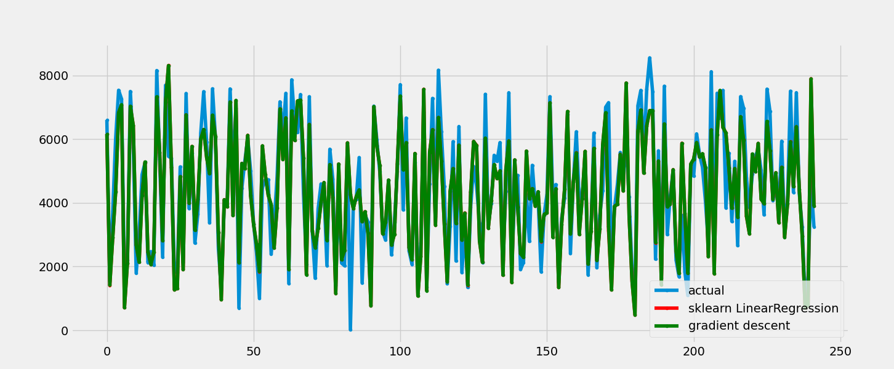

## 案例：用线性回归预测共享单车的需求
### 一、获取数据
数据集：本次使用的数据集来源加利福尼亚大学欧文分校（UCI）的公开数据：https://archive.ics.uci.edu/dataset/275/bike+sharing+dataset  

关于本次数据集的各种信息可以参考该⽹站，同时也可以直接从该⽹站下载和使⽤数据集。不过这个共享单⻋数据集是固定桩形式，还有别于我们常⽤的⼩蓝、⼩⻩等单⻋，且数据集收集时间在2011-2012年,数据分为按⽇和按⼩时。

我们用按日的数据。

### 二、数据预处理
细节描述如下：

    instant：记录索引
    dteday：日期
    season：季节（1：春　2：夏　3：秋　4：冬）
    yr：年份（0：2011，1：2012）
    mnth：月份（1～12）
    hr：小时（0～23）
    holiday：是否是假期
    weekday：工作日
    workingday：如果既不是周末也不是假期则值为1，否则为0
    weathersit：
    晴朗，云层很少，部分多云
    薄雾+多云，薄雾+短暂云，薄雾+少云，薄雾
    小雪，小雨+雷雨+散云，小雨+散云
    大雨+冰粒+雷暴+薄雾，雪+雾
    temp：标准化温度（摄氏度） 计算公式：(t-t_min)/(t_max-t_min), t_min = -8, t_max = +39（仅在小时范围内）
    atemp：标准化体表温度（摄氏度） 计算公式：(t-t_min)/(t_max-t_min), t_min = -16, t_max = +50 (仅在小时范围内)
    hum：归一化湿度。值除以100（最大值）
    windspeed：归一化风速。值除以67（最大值）
    casual：临时用户数
    registered：注册用户数
    cnt：租赁自行车总数，包括临时用户和注册用户

数据完整，无需特别处理。

### 三、特征工程
1.去除casual 和 registered 特征，因为这些特征无法帮助我们从单个用户的角度来模拟需求。
2.instant 和 dteday 不作为特征  
3.cnt 为标签列

### 四、机器学习
#### 4.1 算法选择
共享单车需求预测的目标是预测具体的租车数量（例如：某天内会有多少人租车）。这是一个典型的连续值预测问题，正好落在回归算法的范畴内。线性回归是最基础、最经典的回归算法。

样本数不是很多，可以选择最小二乘法和梯度下降法进行回归对比两者的效果

#### 4.2 划分数据集
1.训练集：$2/3$  
2.测试集：$1/3$  

#### 4.3 训练模型
参考源码：bikesharing.py

### 五、模型评估
算法运行后，预测的可视化结果如下，  
   

|方法|MAE|MSE|
|----|----|----|
|最小二乘法|642.87|777,068.41| 
|梯度下降法|642.48|772,563.40|

**两种方法的结果非常接近**  
- MAE 相差仅约 0.4，MSE 相差约 4,500（相对误差约 0.6%）。这表明两种方法得到的模型性能几乎相同。

- 理论上，对于线性回归问题，最小二乘法（直接求解正规方程）能得到精确的解析解（在数值稳定性范围内），而梯度下降法通过迭代逼近最优解。如果梯度下降的学习率合适、迭代次数足够，最终会收敛到与最小二乘法几乎相同的解。

**梯度下降的结果略好于最小二乘法**
- 梯度下降的 MAE 和 MSE 都略低于最小二乘法，但这可能是由以下原因造成的：

- 数值计算误差：最小二乘法涉及矩阵求逆（或伪逆），当特征矩阵存在多重共线性或条件数较大时，数值解可能不稳定，引入微小误差。

- 梯度下降的收敛性：如果梯度下降实现了良好收敛（例如使用 Adam、适当的学习率调度），有时能绕过最小二乘法中的数值不稳定问题，得到稍好的泛化表现。

- 随机因素：如果梯度下降使用了随机或小批量方式（虽然这里可能用了批量梯度下降），可能会引入一些随机性，但通常差异极小。

**指标含义解读**  
- MAE（平均绝对误差）：平均每个样本的预测值与真实值相差约 642 辆自行车。这个值的大小需要结合共享单车数据的量纲来判断。如果数据中租赁数量范围是几百到几千，600 多的误差可能偏高，说明模型还有改进空间。

- MSE（均方误差）：由于对误差进行了平方，MSE 对离群点更敏感。77 万左右的数值看起来很大，但这是平方后的量级，实际平均误差平方后就是这么大。通常还会看 RMSE（均方根误差），即 MSE 的平方根：

        最小二乘法 RMSE ≈ √777,068 ≈ 881.5

        梯度下降法 RMSE ≈ √772,563 ≈ 878.9
RMSE 与 MAE 量级一致（约 880 vs 640），说明预测误差的分布有些右偏（有少量大误差样本拉高了 RMSE）。